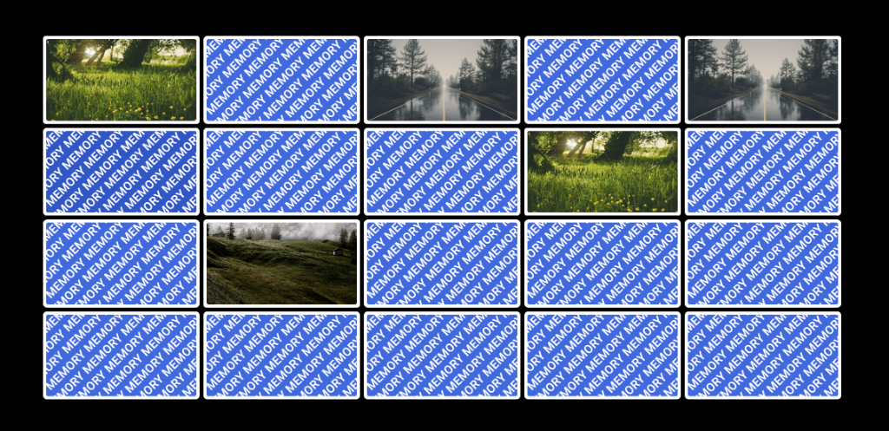

# Memory Game – Portfolio Project

Welcome! This post highlights my Memory Game project, a web-based interactive game designed to showcase my front-end development skills, attention to user experience, and ability to build engaging browser-based applications.



## What is the Memory Game?

The Memory Game is a classic card-matching game where players flip over pairs of cards, trying to find all the matching pairs. The game is fully responsive, visually appealing, and features smooth animations and sound effects for a polished user experience.

## Why I Built It

I created this project to:
- Demonstrate my ability to build interactive web applications from scratch.
- Practice DOM manipulation, event handling, and dynamic UI updates in JavaScript.
- Explore CSS for responsive layouts and engaging visual effects.
- Provide a fun, accessible game that works across modern browsers.

## Technologies and Tools Used

- **HTML5** for structure
- **CSS3** (including custom properties and animations) for styling
- **JavaScript (ES6+)** for game logic and interactivity
- **Custom utility functions** (from my personal `general.js` library)
- **Audio** for feedback (card flip sound)
- **Custom assets** (images, fonts)

## Key Features & Code Highlights

### Dynamic Board Generation
The board size and card layout are determined by the selected difficulty level. The following code snippet shows how the board is dynamically generated:

```js
// ...existing code...
createImages() {
    let horizontal = Math.floor((window.innerWidth - 10) / (index.settings.imageWidth + 10));
    let vertical = Math.floor((window.innerHeight - 10) / (index.settings.imageHeight + 10));
    // ...level switch logic...
    index.board.style.width = (horizontal * (index.settings.imageWidth + 10)) + 'px';
    index.board.style.height = (vertical * (index.settings.imageHeight + 10)) + 'px';
    // ...image generation and shuffling...
}
// ...existing code...
```

### Card Flipping and Matching Logic
Cards are flipped with a smooth animation, and the game logic checks for matches. If all pairs are found, the board resets for a new game:

```js
// ...existing code...
listener.add(image, 'click', (e)=>{
    if (e.currentTarget.hasAttribute('guessed') || index.clickedImages.includes(e.currentTarget) || (index.clickedImages.length == 2)) {
        return;
    }
    let cardFlipAudio = new Audio('./cardFlip.mp3');
    cardFlipAudio.playbackRate = 0.9;
    cardFlipAudio.play();
    index.clickedImages.push(e.currentTarget);
    index.newGuess = parseInt(e.currentTarget.getAttribute('number'));
    e.currentTarget.querySelector('.imageInner').style.transform = 'rotateY(-180deg)';
    // ...matching logic...
});
// ...existing code...
```

### Visual Design and Responsiveness
The game uses modern CSS for layout and effects. For example, the card flip animation is handled with 3D transforms:

```css
/* ...existing code... */
.page .board .image .imageInner {
    position: relative;
    width: 100%;
    height: 100%;
    text-align: center;
    transition: transform 0.6s;
    transform-style: preserve-3d;
}
/* ...existing code... */
```

### Customization and Theming
The game uses CSS variables for easy theming and custom fonts for a modern look:

```css
:root {
    --mainColor: #2a65e4;
    --mainColorDark: #1952cc;
    --white: #ffffff;
    /* ...other variables... */
}

@font-face {
   font-family: 'Roboto';
   src: url('./media/fonts/Roboto-Regular.ttf');
   font-weight: 400;
   font-style: normal;
}
```

### Asset Management
All images and fonts are managed locally for fast loading and full control over the user experience.

## What Have I Learned?

Building this project deepened my understanding of:
- DOM manipulation and event-driven programming in JavaScript
- Responsive design and advanced CSS techniques
- Creating smooth, interactive user experiences
- Managing assets and optimizing for performance

If you’d like to know more about the project, feel free to reach out!
